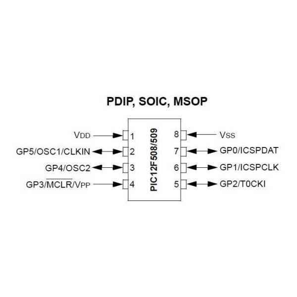

# Microchip-PIC12F509
Proyectos con el microcontrolador PIC12F509

26-09-2018: Dos proyectos, uno hecho en XC8 (lenguaje) pero no está optimizado para consumir poca corriente, el otro hecho en MPASM y optimizado para el menor consumo de corriente.

