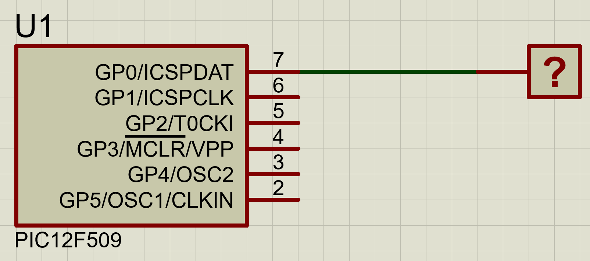

# Microchip-PIC12F509
Ultra low power flasher

Changelog: 
23-09-2018: Initial brainstorm, reading and trying to figure out how to program the device, using Proteus to simulate. First attempt on MPASM showed many errors due to different syntax between PIC18 and PIC12 baseline microcontrollers. Tried to do a delay routine using nested repetitive loops but failed.  

25-09-2018: Learned that there are dedicated instructions to set TRIS register(tris) and OPTION register (option) on baseline micros. Timer0 module doesn't have overflow flag! Larned that WDT wakes up the micro and it has an period time of 18ms between overflows, WDT can be used with prescaler (from Timer0) in order to extend the period, up to 2.3 seconds on PSC 1:128. Made some modifications on the code in order to use the WDT as the delay function of the LED flasher and putting the micro on SLEEP in between. This reduces the power consumption down to 350nA @ 5V while on sleep periods.

